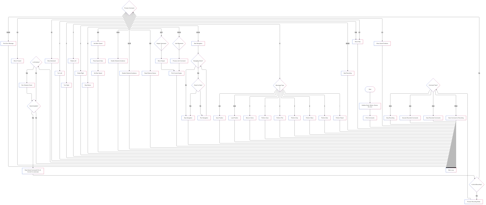

# Unified Robot Control System
## Table of Contents
- [Overview](#overview)
- [Features](#features)
- [Hardware Requirements](#hardware-requirements)
- [System Architecture](#system-architecture)
- [Installation](#installation)
- [Pin Configuration](#pin-configuration)
- [Usage](#usage)
- [Command Reference](#command-reference)
- [Flowchart](#flowchart)
- [Simulation](#simulation)
- [Contributing](#contributing)
- [Troubleshooting](#troubleshooting)

## Overview
The Unified Robot Control System is an integrated Arduino-based platform that combines a mobile robot base with a robotic arm. This system provides comprehensive control over both locomotion and manipulation tasks through a simple serial command interface. The platform features obstacle avoidance capabilities for autonomous navigation and precise arm control with position memory and command recording functionality.

## Features
### Mobile Base
- Differential drive system with dual motor control
- Variable speed control
- Multiple movement modes (forward, backward, turning, rotation)
- Ultrasonic-based obstacle detection and avoidance
- Autonomous navigation capability

### Robotic Arm
- 4-DOF configuration (base, shoulder, elbow, gripper)
- Position memory system (up to 3 saved positions)
- Command recording and playback functionality
- Pre-programmed movement sequences
- Real-time joint angle feedback

## Hardware Requirements
### Components
- 1× Arduino board (Uno/Mega recommended)
- 2× DC motors for differential drive
- 1× L298N motor driver module
- 1× HC-SR04 ultrasonic sensor
- 4× Servo motors (for robotic arm)
- Power supply (12V for motors, 5V for servos)
- Various connecting wires and mounting hardware

### Specifications
- DC Motors: 12V, recommended 100-300 RPM
- Servo Motors:
  - Base: High-torque servo (>15kg.cm)
  - Shoulder: High-torque servo (>15kg.cm)
  - Elbow: Standard servo (>10kg.cm)
  - Gripper: Standard servo (>5kg.cm)
- Ultrasonic Sensor: HC-SR04 (Operating voltage: 5V)
- Power Requirements:
  - Logic: 5V (via Arduino)
  - Motors: 12V, 2A minimum
  - Servos: 5V, 2A minimum

## System Architecture
### Software Components
- `MotorController`: Manages differential drive system
- `UltrasonicSensor`: Handles distance sensing
- `ObstacleAvoidance`: Implements navigation algorithms
- `RobotArm`: Controls servo movements and arm functionality

### Libraries Required
- Servo.h
- Wire.h
- Custom libraries:
  - MotorController.h
  - UltrasonicSensor.h
  - ObstacleAvoidance.h
  - RobotArm.h

## Installation
1. Clone the repository.

2. Install required libraries:
   - Copy all custom libraries to Arduino libraries folder
   - Install standard libraries through Arduino IDE

3. Connect hardware according to pin configuration
4. Upload the code to Arduino board
5. Open serial monitor (9600 baud rate)

## Pin Configuration
### Mobile Base
```
MOTOR1_IN1 = 3    // Left motor control 1
MOTOR1_IN2 = 4    // Left motor control 2
MOTOR2_IN1 = 5    // Right motor control 1
MOTOR2_IN2 = 6    // Right motor control 2
MOTOR1_ENA = 9    // Left motor enable/PWM
MOTOR2_ENB = 10   // Right motor enable/PWM
TRIG_PIN = 12     // Ultrasonic trigger
ECHO_PIN = 2      // Ultrasonic echo
```

### Robotic Arm
```
BASE_PIN = 13      // Base servo
SHOULDER_PIN = 7   // Shoulder servo
ELBOW_PIN = 8      // Elbow servo
GRIPPER_PIN = 11   // Gripper servo
```

## Usage
### Initial Setup
1. Power up the system
2. Open serial monitor (9600 baud)
3. Type 'help' for command list
4. Verify all motors and servos respond to commands

### Basic Operation
1. Mobile Base Control:
   ```
   mv  - Move forward
   bk  - Move backward
   lt  - Turn left
   rt  - Turn right
   st  - Stop
   ```

2. Arm Control:
   ```
   b+ / b-  - Base rotation
   s+ / s-  - Shoulder movement
   e+ / e-  - Elbow movement
   g o / g c - Gripper open/close
   ```

## Command Reference
### Mobile Base Commands
| Command | Description | Parameters |
|---------|-------------|------------|
| mv | Move forward | None |
| bk | Move backward | None |
| lt | Turn left | None |
| rt | Turn right | None |
| rl | Rotate left | None |
| rr | Rotate right | None |
| st | Stop motors | None |
| spd | Set motor speed | 0-255 |
| oa on | Enable obstacle avoidance | None |
| oa off | Disable obstacle avoidance | None |
| oa nav | Start autonomous navigation | None |
| dist | Read distance sensor | None |

### Robotic Arm Commands
| Command | Description | Parameters |
|---------|-------------|------------|
| b+/b- | Move base joint | None |
| s+/s- | Move shoulder joint | None |
| e+/e- | Move elbow joint | None |
| g o/c | Gripper control | o=open, c=close |
| m h | Home position | None |
| m s | Scan position | None |
| m p | Pick position | None |
| m d | Drop position | None |
| m pos | Save position | 1-3 |
| m save | Load position | 1-3 |
| stream | Start recording | None |
| done | Stop recording | None |
| play | Execute recording | None |
| clear | Clear recording | None |
| p h | Print help | None |
| p s | Print saved positions | None |

## Flowchart




## Contributing
1. Fork the repository
2. Create feature branch
3. Commit changes
4. Push to branch
5. Create Pull Request

## Troubleshooting
### Common Issues
1. Motors not responding:
   - Check power supply
   - Verify pin connections
   - Check motor driver connections

2. Erratic arm movement:
   - Verify servo power supply
   - Check servo current draw
   - Inspect mechanical connections

3. Communication issues:
   - Verify baud rate (9600)
   - Check USB connection
   - Reset Arduino board

### LED Indicators
- Power LED: System power status
- Communication LED: Serial activity
- Error LED: System fault indication
